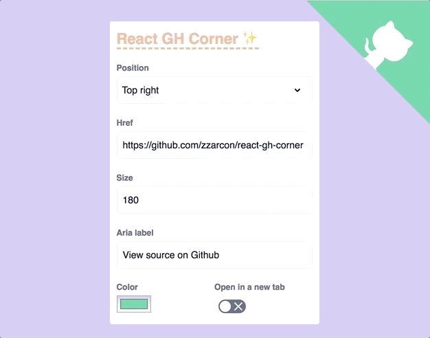

# react-gh-corner [](https://travis-ci.org/zzarcon/react-gh-corner)
> React portals + Github corners + Styled component = 💘

<div align="center">
  
  <br><br>
</div>

# Demo 🍿

[https://zzarcon.github.io/react-gh-corner](https://zzarcon.github.io/react-gh-corner)

# Install 🚀

```
$ yarn add react-gh-corner
```

# Usage ⛏

**Basic** 

```tsx
import GHCorner from 'react-gh-corner';

<GHCorner href="https://github.com/zzarcon/react-gh-corner" />
```

**Custom**

```tsx
import GHCorner from 'react-gh-corner';

<GHCorner
  href="https://github.com/zzarcon/react-gh-corner"
  position="top-right"
  bgColor="hotpink"
  size={250}
  ariaLabel="Check my project"
  openInNewTab={true}
/>
```

# Api 📚

```ts
type CornerPosition = 'top-right' | 'top-left';

interface Props {
  href: string;
  position?: CornerPosition;
  bgColor?: string;
  size?: number;
  ariaLabel?: string;
  openInNewTab?: boolean;
}
```

See [example/](https://github.com/zzarcon/react-gh-corner/tree/master/example) for full example.

# Author

[@zzarcon](https://twitter.com/zzarcon)
